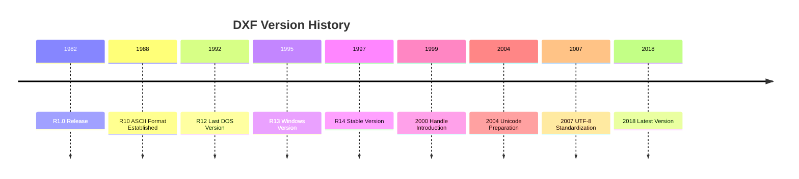

# DXF History and Versions

DXF (Drawing Exchange Format) is a CAD data exchange format introduced by AutoCAD in 1982. It has over 40 years of history and has undergone many version updates to reach its current state.

## Version Evolution



## Major Versions and Features

### R12 (AC1009) - 1992

**Features**:
- Last DOS version of AutoCAD
- ASCII format established
- Fixed-width format (group codes have fixed digits)
- Many CAD software support this format

**Compatibility**: Very high. Almost all CAD software can read it.

**Implementation Notes**: 
- Group codes may contain fixed numbers of spaces before and after
- Character encoding is environment-dependent (code page)

### R13 (AC1012) - 1995

**Features**:
- First Windows version of AutoCAD
- Introduction of binary DXF format (optional)
- **Introduction of SPLINE (NURBS) entities**: Enables mathematically precise representation of complex curves

**Changes**: 
- Extension of section structure
- More flexible format
- Addition of `ELLIPSE` entity

### R14 (AC1014) - 1997

**Features**:
- Improved stability
- Many bug fixes

**Compatibility**: Maintains high compatibility with R12.

### AutoCAD 2000 (AC1015) - 1999

**Features**:
- **Introduction of Handles**: Unique IDs assigned to each object
- Enhanced object references
- Addition of OBJECTS section

**Changes**:
- Handles specified with group code `5`
- Addition of `$HANDSEED` header variable

**Implementation Notes**: Handles are saved as hexadecimal strings.

### AutoCAD 2004 (AC1018) - 2004

**Features**:
- File format stabilization
- Performance improvements

### AutoCAD 2007 (AC1021) - 2007

**Features**:
- **UTF-8 encoding standardization**: Significantly improved internationalization support
- Resolution of character encoding issues

**Changes**:
- Text data saved in UTF-8
- Use of BOM (Byte Order Mark) recommended

**Implementation Notes**: From this version onward, it's safe to read as UTF-8.

### AutoCAD 2010 (AC1024) - 2010

**Features**:
- Performance optimization
- Addition of new entity types

### AutoCAD 2013-2017 (AC1027) - 2013-2017

**Features**:
- Same version code used over a long period
- Features added while maintaining file format compatibility

### AutoCAD 2018 and later (AC1032) - 2018

**Features**:
- Latest file format
- Maintains backward compatibility

## Version Compatibility Matrix

| Version | Readable | Writable | Main Limitations |
| :--- | :--- | :--- | :--- |
| R12 | All | R12 and earlier | No handles, fixed-width format |
| R13-R14 | R12 and later | R14 and earlier | No handles |
| 2000 | R12 and later | 2000 and later | Handles required |
| 2007 | R12 and later | 2007 and later | UTF-8 recommended |
| 2018 | R12 and later | 2018 and later | Supports latest features |

## Version Detection Method

DXF file version is determined by the `$ACADVER` variable in the HEADER section:

```text
  9
$ACADVER
  1
AC1015
```

**Version Code List**:

| Code | Version | Release Year |
| :--- | :--- | :--- |
| `AC1009` | R12 | 1992 |
| `AC1012` | R13 | 1995 |
| `AC1014` | R14 | 1997 |
| `AC1015` | 2000/2000i/2002 | 1999-2002 |
| `AC1018` | 2004/2005/2006 | 2004-2006 |
| `AC1021` | 2007/2008/2009 | 2007-2009 |
| `AC1024` | 2010/2011/2012 | 2010-2012 |
| `AC1027` | 2013/2014/2015/2016/2017 | 2013-2017 |
| `AC1032` | 2018 and later | 2018- |

## Backward Compatibility Principles

AutoCAD is designed with emphasis on **backward compatibility**:

1. **Readable in older versions**: DXF files created in newer versions can be read in older versions (with feature limitations)
2. **Ignoring new features**: New group codes and entities that older versions cannot understand are ignored
3. **Using default values**: Missing data is supplemented with reasonable default values

## Implementation Recommendations

### 1. Version-Specific Processing

```python
def parse_dxf(file_path):
    # First check version
    version = detect_version(file_path)
    
    if version < 'AC1015':
        # Processing without handles
        parser = LegacyParser()
    elif version < 'AC1021':
        # Encoding processing before UTF-8
        parser = AnsiParser()
    else:
        # UTF-8 standard processing
        parser = Utf8Parser()
    
    return parser.parse(file_path)
```

### 2. Minimum Version Selection

If you don't use new features, you can ensure maximum compatibility by **saving in R12 format**:

```python
# Example with ezdxf
doc = ezdxf.new('R12')  # Highest compatibility
doc.saveas("output.dxf")
```

### 3. Notes on Version Upgrades

- **Handle handling**: From AC1015 onward, handles may become required
- **Character encoding**: From AC1021 onward, use UTF-8
- **New entities**: May not be recognized in older versions

## Management and Governance

DXF is a **proprietary standard** for which Autodesk holds copyright. However, through the following operations, it has built a position like public infrastructure.

1. **Free specification publication**: With each new AutoCAD release, the specification (DXF Reference) is published online for free.
2. **License-free**: Developers can freely implement and distribute parsers based on the specification without paying license fees to Autodesk.
3. **Emphasis on backward compatibility**: Even R12 format from decades ago is guaranteed to open in the latest AutoCAD.

For details, see [International Standards and DXF's Position](../comparison/standardization-and-iso.md).

## Summary

DXF version management takes a balanced approach of extending functionality while maintaining compatibility. It's important for implementers to implement appropriate processing according to the target version and maintain backward compatibility as much as possible.

**Recommendation**: Unless there's a specific reason, saving in **R12 format** ensures maximum compatibility.
