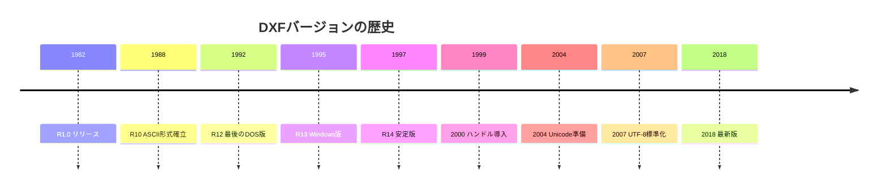

# DXFの歴史とバージョン

DXF（Drawing Exchange Format）は、AutoCADが1982年に導入したCADデータ交換形式です。40年以上の歴史を持ち、多くのバージョンアップを経て現在に至ります。

## バージョンの変遷



## 主要バージョンと特徴

### R12 (AC1009) - 1992年

**特徴**:
- DOS版AutoCADの最後のバージョン
- ASCII形式が確立
- 固定幅フォーマット（グループコードが固定桁数）
- 多くのCADソフトがこの形式をサポート

**互換性**: 非常に高い。ほぼすべてのCADソフトが読み込み可能。

**実装上の注意**: 
- グループコードの前後に固定数の空白が含まれる場合がある
- 文字エンコーディングは環境依存（コードページ）

### R13 (AC1012) - 1995年

**特徴**:
- Windows版AutoCADの最初のバージョン
- バイナリDXF形式の導入（オプション）

**変更点**: 
- セクション構造の拡張
- より柔軟なフォーマット

### R14 (AC1014) - 1997年

**特徴**:
- 安定性の向上
- 多くのバグ修正

**互換性**: R12と高い互換性を維持。

### AutoCAD 2000 (AC1015) - 1999年

**特徴**:
- **ハンドル（Handle）の導入**: 各オブジェクトに一意のIDが割り当てられる
- オブジェクト参照の強化
- OBJECTSセクションの追加

**変更点**:
- グループコード `5` でハンドルを指定
- `$HANDSEED` ヘッダー変数の追加

**実装上の注意**: ハンドルは16進数文字列として保存されます。

### AutoCAD 2004 (AC1018) - 2004年

**特徴**:
- ファイル形式の安定化
- パフォーマンスの向上

### AutoCAD 2007 (AC1021) - 2007年

**特徴**:
- **UTF-8エンコーディングの標準化**: 国際化対応が大幅に改善
- 文字化け問題の解消

**変更点**:
- テキストデータがUTF-8で保存される
- BOM（Byte Order Mark）の使用が推奨される

**実装上の注意**: このバージョン以降は、UTF-8として読み込むことが安全です。

### AutoCAD 2010 (AC1024) - 2010年

**特徴**:
- パフォーマンスの最適化
- 新しいエンティティタイプの追加

### AutoCAD 2013-2017 (AC1027) - 2013-2017年

**特徴**:
- 長期間にわたって同じバージョンコードを使用
- 機能追加はあるが、ファイル形式の互換性を維持

### AutoCAD 2018以降 (AC1032) - 2018年

**特徴**:
- 最新のファイル形式
- 後方互換性を維持

## バージョン互換性のマトリックス

| バージョン | 読み込み可能 | 書き込み可能 | 主な制限 |
| :--- | :--- | :--- | :--- |
| R12 | すべて | R12以前 | ハンドルなし、固定幅フォーマット |
| R13-R14 | R12以降 | R14以前 | ハンドルなし |
| 2000 | R12以降 | 2000以降 | ハンドル必須 |
| 2007 | R12以降 | 2007以降 | UTF-8推奨 |
| 2018 | R12以降 | 2018以降 | 最新機能に対応 |

## バージョン判定方法

DXFファイルのバージョンは、HEADERセクションの `$ACADVER` 変数で判定します：

```text
  9
$ACADVER
  1
AC1015
```

**バージョンコード一覧**:

| コード | バージョン | リリース年 |
| :--- | :--- | :--- |
| `AC1009` | R12 | 1992 |
| `AC1012` | R13 | 1995 |
| `AC1014` | R14 | 1997 |
| `AC1015` | 2000/2000i/2002 | 1999-2002 |
| `AC1018` | 2004/2005/2006 | 2004-2006 |
| `AC1021` | 2007/2008/2009 | 2007-2009 |
| `AC1024` | 2010/2011/2012 | 2010-2012 |
| `AC1027` | 2013/2014/2015/2016/2017 | 2013-2017 |
| `AC1032` | 2018以降 | 2018- |

## 後方互換性の原則

AutoCADは、**後方互換性**を重視して設計されています：

1. **古いバージョンで読み込める**: 新しいバージョンで作成したDXFファイルは、古いバージョンでも（機能制限はあるが）読み込める
2. **新しい機能の無視**: 古いバージョンでは理解できない新しいグループコードやエンティティは無視される
3. **デフォルト値の使用**: 欠けているデータは、合理的なデフォルト値で補完される

## 実装上の推奨事項

### 1. バージョンに応じた処理

```python
def parse_dxf(file_path):
    # まずバージョンを確認
    version = detect_version(file_path)
    
    if version < 'AC1015':
        # ハンドルなしの処理
        parser = LegacyParser()
    elif version < 'AC1021':
        # UTF-8以前のエンコーディング処理
        parser = AnsiParser()
    else:
        # UTF-8標準の処理
        parser = Utf8Parser()
    
    return parser.parse(file_path)
```

### 2. 最小バージョンの選択

新しい機能を使用しない場合は、**R12形式で保存**することで、最大限の互換性を確保できます：

```python
# ezdxfの例
doc = ezdxf.new('R12')  # 最も互換性が高い
doc.saveas("output.dxf")
```

### 3. バージョンアップ時の注意

- **ハンドルの扱い**: AC1015以降では、ハンドルが必須になる場合がある
- **文字エンコーディング**: AC1021以降では、UTF-8を使用する
- **新しいエンティティ**: 古いバージョンでは認識されない可能性がある

## まとめ

DXFのバージョン管理は、互換性を維持しながら機能を拡張するという、バランスの取れたアプローチを取っています。実装者は、対象とするバージョンに応じて適切な処理を実装し、可能な限り後方互換性を保つことが重要です。

**推奨**: 特に理由がなければ、**R12形式**で保存することで、最大限の互換性を確保できます。
