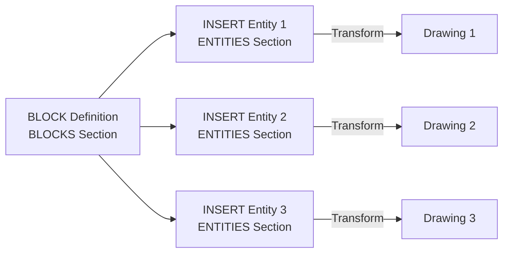

# ブロックとインサート

DXFでは、**ブロック（BLOCK）** という仕組みを使って、図形の再利用を実現します。ブロックは「定義」と「参照（INSERT）」に分かれています。

## ブロックの概念



1. **BLOCK定義**: BLOCKSセクションで、再利用可能な図形を1回だけ定義します。
2. **INSERTエンティティ**: ENTITIESセクションで、ブロックを任意の位置・スケール・回転で配置します。

## BLOCK定義の構造

BLOCK定義は、BLOCKSセクション内に記述されます。

### BLOCKエントリの構造

```text
  0
BLOCK
  5
ハンドル
  2
ブロック名
 70
フラグ
 10
基点X
 20
基点Y
 30
基点Z
  3
ブロック名（繰り返し）
  0
[エンティティ1]
  ...
  0
[エンティティ2]
  ...
  0
ENDBLK
  5
ハンドル
```

**主要なグループコード**:

| コード | 型 | 説明 |
| :--- | :--- | :--- |
| `2` | 文字列 | ブロック名（一意である必要がある） |
| `70` | 整数 | フラグ（1=匿名、2=非矩形クリッピング、4=外部参照） |
| `10, 20, 30` | 浮動小数点 | 基点（INSERT時の挿入点）の座標 |

### 例：シンプルなブロック定義

```text
  0
SECTION
  2
BLOCKS
  0
BLOCK
  5
20
  2
MyBlock
 70
0
 10
0.0
 20
0.0
 30
0.0
  3
MyBlock
  0
LINE
  8
0
 10
0.0
 20
0.0
 11
10.0
 21
10.0
  0
CIRCLE
  8
0
 10
5.0
 20
5.0
 40
2.5
  0
ENDBLK
  5
21
  0
ENDSEC
```

この例では、`MyBlock` という名前のブロックを定義しています。このブロックは、1本の線と1つの円を含みます。

**実装上の注意**: 
- ブロック名 `"*Model_Space"` と `"*Paper_Space"` は予約されており、モデル空間とレイアウト空間の区別に使用されます。
- ブロック内のエンティティの座標は、**ブロックのローカル座標系**で定義されます。基点は `(0, 0, 0)` にすることが多いです。

## INSERTエンティティ

INSERTエンティティは、ENTITIESセクションでブロックを参照し、実際の図面に配置します。

### INSERTエンティティの構造

```text
  0
INSERT
  5
ハンドル
  8
画層名
  2
ブロック名
 10
挿入点X
 20
挿入点Y
 30
挿入点Z
 41
Xスケール
 42
Yスケール
 43
Zスケール
 50
回転角度（度）
```

**主要なグループコード**:

| コード | 型 | 説明 |
| :--- | :--- | :--- |
| `2` | 文字列 | ブロック名（BLOCKSセクションで定義されたもの） |
| `10, 20, 30` | 浮動小数点 | 挿入点（WCS）の座標 |
| `41, 42, 43` | 浮動小数点 | X, Y, Z方向のスケール係数（デフォルト: 1.0） |
| `50` | 浮動小数点 | 回転角度（度、反時計回り） |

### 例：ブロックの配置

```text
  0
SECTION
  2
ENTITIES
  0
INSERT
  5
200
  8
0
  2
MyBlock
 10
0.0
 20
0.0
 30
0.0
 41
1.0
 42
1.0
 43
1.0
 50
0.0
  0
INSERT
  5
201
  8
0
  2
MyBlock
 10
20.0
 20
10.0
 30
0.0
 41
2.0
 42
2.0
 43
1.0
 50
45.0
  0
ENDSEC
```

この例では、`MyBlock` を2回配置しています：
1. 1回目: 位置 `(0, 0, 0)`、スケール `1.0`、回転 `0°`
2. 2回目: 位置 `(20, 10, 0)`、スケール `2.0`、回転 `45°`

## 変換行列の計算

INSERTエンティティは、ブロック内のエンティティに対して**アフィン変換**を適用します。変換は以下の順序で行われます：

1. **スケール**: X, Y, Z方向にスケール係数を適用
2. **回転**: Z軸周りに回転角度を適用
3. **平行移動**: 挿入点へ移動

### 変換式

ブロック内の点 $P_{block} = (x_b, y_b, z_b)$ を、INSERTの設定に基づいてWCS上の点 $P_{wcs} = (x_w, y_w, z_w)$ に変換する式：

$$
\begin{bmatrix} x_w \\ y_w \\ z_w \end{bmatrix} = \begin{bmatrix} s_x \cos\theta & -s_x \sin\theta & 0 \\ s_y \sin\theta & s_y \cos\theta & 0 \\ 0 & 0 & s_z \end{bmatrix} \begin{bmatrix} x_b \\ y_b \\ z_b \end{bmatrix} + \begin{bmatrix} t_x \\ t_y \\ t_z \end{bmatrix}
$$

ここで：
- $s_x, s_y, s_z$: スケール係数（グループコード `41, 42, 43`）
- $\theta$: 回転角度（ラジアン、グループコード `50`）
- $t_x, t_y, t_z$: 挿入点（グループコード `10, 20, 30`）

## ネストされたブロック

ブロック定義内に、別のブロックを参照するINSERTエンティティを含めることができます。これにより、階層的な図形構造を構築できます。

**実装上の注意**: 無限再帰を避けるため、パーサーはブロック参照の深さに制限を設ける必要があります。

## 属性（ATTRIBUTE）

ブロック定義には、**属性（ATTRIBUTE）** を含めることができます。属性は、INSERT時に値を設定できるテキストフィールドです。

### ATTRIB定義の構造（ブロック内）

```text
  0
ATTDEF
  8
画層名
 10
位置X
 20
位置Y
 30
位置Z
  1
デフォルト値
  2
属性タグ名
  3
プロンプト文字列
 40
文字高さ
```

### ATTRIBエンティティの構造（INSERT時）

```text
  0
INSERT
  ...
  0
ATTRIB
  8
画層名
  1
属性値
  2
属性タグ名
 10
位置X
 20
位置Y
 30
位置Z
```

**実装上の注意**: INSERTエンティティの直後に、対応するATTRIBエンティティが続きます。すべてのATTRIBが読み込まれるまで、次のINSERTエンティティに進んではいけません。

## 実装のベストプラクティス

1. **ブロック辞書の構築**: BLOCKSセクションを読み込む際に、ブロック名をキーとする辞書を構築します。
2. **参照解決**: INSERTエンティティを読み込む際に、ブロック名が存在するか確認します。
3. **変換の効率化**: 同じブロックを複数回配置する場合、変換行列を事前計算してキャッシュします。
4. **エラーハンドリング**: 存在しないブロックを参照している場合、警告を出してスキップするか、空の図形として扱います。
