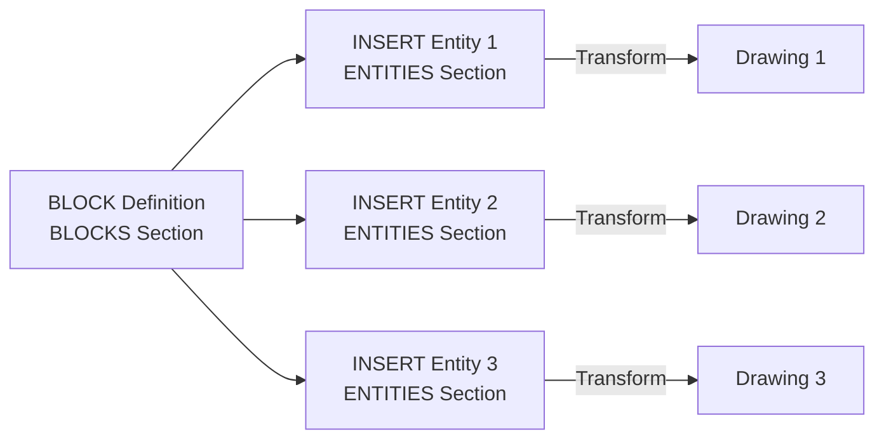

# Blocks and Inserts

DXF uses a mechanism called **blocks (BLOCK)** to achieve shape reuse. Blocks are divided into "definitions" and "references (INSERT)".

## Block Concept



1. **BLOCK Definition**: Define reusable shapes once in the BLOCKS section.
2. **INSERT Entity**: Place blocks at arbitrary positions, scales, and rotations in the ENTITIES section.

## BLOCK Definition Structure

BLOCK definitions are written in the BLOCKS section.

### BLOCK Entry Structure

```text
  0
BLOCK
  5
Handle
  2
BlockName
 70
Flag
 10
BasePointX
 20
BasePointY
 30
BasePointZ
  3
BlockName (repeated)
  0
[Entity1]
  ...
  0
[Entity2]
  ...
  0
ENDBLK
  5
Handle
```

**Major Group Codes**:

| Code | Type | Description |
| :--- | :--- | :--- |
| `2` | String | Block name (must be unique) |
| `70` | Integer | Flag (1=anonymous, 2=non-rectangular clipping, 4=external reference) |
| `10, 20, 30` | Floating point | Base point (insertion point) coordinates |

### Example: Simple Block Definition

```text
  0
SECTION
  2
BLOCKS
  0
BLOCK
  5
20
  2
MyBlock
 70
0
 10
0.0
 20
0.0
 30
0.0
  3
MyBlock
  0
LINE
  8
0
 10
0.0
 20
0.0
 11
10.0
 21
10.0
  0
CIRCLE
  8
0
 10
5.0
 20
5.0
 40
2.5
  0
ENDBLK
  5
21
  0
ENDSEC
```

This example defines a block named `MyBlock`. This block contains one line and one circle.

**Implementation Notes**: 
- Block names `"*Model_Space"` and `"*Paper_Space"` are reserved and used to distinguish model space and layout space.
- Entity coordinates within blocks are defined in the **block's local coordinate system**. The base point is often `(0, 0, 0)`.

## INSERT Entity

INSERT entities reference blocks in the ENTITIES section and place them in the actual drawing.

### INSERT Entity Structure

```text
  0
INSERT
  5
Handle
  8
LayerName
  2
BlockName
 10
InsertionPointX
 20
InsertionPointY
 30
InsertionPointZ
 41
XScale
 42
YScale
 43
ZScale
 50
RotationAngle (degrees)
```

**Major Group Codes**:

| Code | Type | Description |
| :--- | :--- | :--- |
| `2` | String | Block name (defined in BLOCKS section) |
| `10, 20, 30` | Floating point | Insertion point (WCS) coordinates |
| `41, 42, 43` | Floating point | Scale factors in X, Y, Z directions (default: 1.0) |
| `50` | Floating point | Rotation angle (degrees, counterclockwise) |

### Example: Block Placement

```text
  0
SECTION
  2
ENTITIES
  0
INSERT
  5
200
  8
0
  2
MyBlock
 10
0.0
 20
0.0
 30
0.0
 41
1.0
 42
1.0
 43
1.0
 50
0.0
  0
INSERT
  5
201
  8
0
  2
MyBlock
 10
20.0
 20
10.0
 30
0.0
 41
2.0
 42
2.0
 43
1.0
 50
45.0
  0
ENDSEC
```

This example places `MyBlock` twice:
1. First: Position `(0, 0, 0)`, scale `1.0`, rotation `0°`
2. Second: Position `(20, 10, 0)`, scale `2.0`, rotation `45°`

## Transformation Matrix Calculation

INSERT entities apply **affine transformations** to entities within blocks. Transformations are performed in the following order:

1. **Scale**: Apply scale factors in X, Y, Z directions
2. **Rotation**: Apply rotation angle around Z axis
3. **Translation**: Move to insertion point

### Transformation Formula

Formula to transform point $P_{block} = (x_b, y_b, z_b)$ within a block to point $P_{wcs} = (x_w, y_w, z_w)$ on WCS based on INSERT settings:

$$
\begin{bmatrix} x_w \\ y_w \\ z_w \end{bmatrix} = \begin{bmatrix} s_x \cos\theta & -s_x \sin\theta & 0 \\ s_y \sin\theta & s_y \cos\theta & 0 \\ 0 & 0 & s_z \end{bmatrix} \begin{bmatrix} x_b \\ y_b \\ z_b \end{bmatrix} + \begin{bmatrix} t_x \\ t_y \\ t_z \end{bmatrix}
$$

Where:
- $s_x, s_y, s_z$: Scale factors (group codes `41, 42, 43`)
- $\theta$: Rotation angle (radians, group code `50`)
- $t_x, t_y, t_z$: Insertion point (group codes `10, 20, 30`)

## Nested Blocks

Block definitions can contain INSERT entities that reference other blocks. This allows building hierarchical shape structures.

**Implementation Notes**: To avoid infinite recursion, parsers need to set limits on block reference depth.

## Attributes (ATTRIBUTE)

Block definitions can include **attributes (ATTRIBUTE)**. Attributes are text fields that can be set when inserting.

### ATTRIB Definition Structure (within block)

```text
  0
ATTDEF
  8
LayerName
 10
PositionX
 20
PositionY
 30
PositionZ
  1
DefaultValue
  2
AttributeTagName
  3
PromptString
 40
TextHeight
```

### ATTRIB Entity Structure (at INSERT time)

```text
  0
INSERT
  ...
  0
ATTRIB
  8
LayerName
  1
AttributeValue
  2
AttributeTagName
 10
PositionX
 20
PositionY
 30
PositionZ
```

**Implementation Notes**: ATTRIB entities corresponding to an INSERT entity follow immediately after it. Do not proceed to the next INSERT entity until all ATTRIB entities are read.

## Implementation Best Practices

1. **Build Block Dictionary**: When reading the BLOCKS section, build a dictionary keyed by block names.
2. **Reference Resolution**: When reading INSERT entities, check if the block name exists.
3. **Transformation Optimization**: When placing the same block multiple times, pre-calculate and cache transformation matrices.
4. **Error Handling**: If a non-existent block is referenced, issue a warning and skip it, or treat it as an empty shape.
