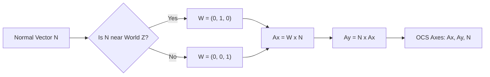

# 座標系 (WCS/OCS/AAA)

DXFを実装する上で最大の難所と言われるのが、**OCS (Object Coordinate System: オブジェクト座標系)** と **任意軸アルゴリズム (Arbitrary Axis Algorithm)** です。

## 3つの座標系

DXFには主に以下の3つの座標系が登場します。

1. **WCS (World Coordinate System)**:
   絶対的な世界座標系。図面全体の基準となる。
2. **OCS (Object Coordinate System)**:
   各エンティティ（円、円弧、ポリライン等）が個別に持つ座標系。図形データ（中心点や頂点）はこのOCS上で定義される。
3. **DCS (Display Coordinate System)**:
   画面表示用の座標系。

## なぜ OCS が必要なのか？

2Dエンティティ（例えば円）が3D空間内に傾いて配置されている場合、その中心座標を3D (X, Y, Z) で持つよりも、「法線ベクトル」と「2D平面上の中心 (x, y)」で持つ方が、データの冗長性を排除でき、編集（厚みの追加など）も容易になります。

## 任意軸アルゴリズム (Arbitrary Axis Algorithm)

法線ベクトル $\mathbf{N} = (N_x, N_y, N_z)$ が与えられたとき、それに対応するOCSの $X$ 軸 ($\mathbf{A_x}$) と $Y$ 軸 ($\mathbf{A_y}$) を算出するアルゴリズムです。

### アルゴリズムの手順

1.  **法線ベクトルの正規化**: $\mathbf{N}$ を単位ベクトルにします。
2.  **基準軸 $\mathbf{W}$ の決定**:
    もし $|N_x| < 1/64$ かつ $|N_y| < 1/64$ なら、 $\mathbf{W} = (0, 1, 0)$ (世界 $Y$ 軸) とします。
    それ以外の場合は、 $\mathbf{W} = (0, 0, 1)$ (世界 $Z$ 軸) とします。
3.  **OCS X軸 ($\mathbf{A_x}$) の算出**:
    $\mathbf{A_x} = \mathbf{W} \times \mathbf{N}$ （外積）
4.  **OCS Y軸 ($\mathbf{A_y}$) の算出**:
    $\mathbf{A_y} = \mathbf{N} \times \mathbf{A_x}$ （外積）

### なぜ 1/64 なのか？
これは AutoCAD が歴史的に採用している閾値です。法線が世界 $Z$ 軸に非常に近い場合に、計算の安定性を確保するために軸を切り替えます。

## 実装での変換式

OCS上の点 $P_{ocs} = (x, y, z)$ を WCS上の点 $P_{wcs}$ に変換する式は以下の通りです。

$$
P_{wcs} = x\mathbf{A_x} + y\mathbf{A_y} + z\mathbf{N}
$$

逆に WCS から OCS への変換は、逆行列（回転行列の転置）を用います。

$$
P_{ocs} = (P_{wcs} \cdot \mathbf{A_x}, P_{wcs} \cdot \mathbf{A_y}, P_{wcs} \cdot \mathbf{N})
$$

## 注意点
- **LWPOLYLINE**: このエンティティの頂点データ (コード10, 20) は常に OCS の $x, y$ です。$z$ 座標（標高）はコード 38 で指定されます。
- **押し出し (Extrusion)**: コード 210, 220, 230 が法線ベクトル $\mathbf{N}$ を表します。これがない場合は $(0, 0, 1)$ とみなされます。

