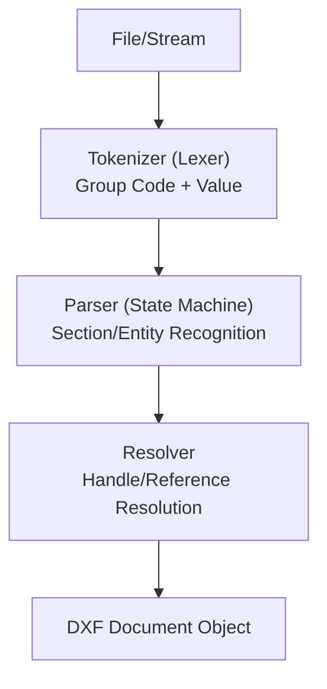

# Parser Design

This explains architecture design and implementation strategies for efficiently and robustly reading DXF files.

## 1. Pipeline Structure

DXF parsers are best designed as pipelines consisting of the following three main phases.

## 2. State Transition Table (Parser States)

Since DXF has a hierarchical structure, control via state machine is recommended. Below are definitions of major state transitions.

| Current State | Input (Code=0, Value) | Next State | Processing Content |
| :--- | :--- | :--- | :--- |
| `ROOT` | `SECTION` | `SECTION_START` | Prepare for section start |
| `SECTION_START` | `(Code 2: NAME)` | `IN_SECTION` | Identify section name (HEADER, etc.) |
| `IN_SECTION` | `ENDSEC` | `ROOT` | Section end, confirm data |
| `IN_SECTION (ENTITIES)` | `(Any Entity Type)` | `IN_ENTITY` | Generate entity object |
| `IN_ENTITY` | `(Any Entity Type)` | `IN_ENTITY` | Save previous entity and generate next |
| `IN_ENTITY` | `ENDSEC` | `ROOT` | Section end, save last entity |
| `ANY` | `EOF` | `FINISHED` | Reading complete |

## 3. Testing Strategy

The following testing methods are recommended to ensure DXF parser quality.

### 1. Round-trip Test
Perform "read → write as-is" and verify that the original file and output file are logically identical (coordinates and handles unchanged).
※ Text spaces may change, so compare data structures after re-reading rather than binary comparison.

### 2. Visual Validation
Draw parsed data to SVG or Canvas and visually compare with the original drawing (PDF output from AutoCAD, etc.). Particularly effective for discovering **OCS (coordinate system)** bugs.

### 3. Incomplete Data Tolerance Tests
- Files without `EOF`
- Files without `HEADER` section
- Entities with group codes in random order
Verify that these cases don't crash and can recover data as much as possible.

## 4. Guidelines for Robust Parsing

1. **Type-safe Value Conversion**: Expected types (float, int, string) are strictly determined for each group code. Have a mechanism to return default values or skip as errors when invalid types come.
2. **Ignoring Unknown Codes**: DXF specifications are constantly being extended. Flexibility is needed to ignore unknown group codes and proceed to the next pair.
3. **Character Code Fallback**: If UTF-8 parsing fails, having a mechanism to retry with CP932 (Shift-JIS) or Windows-1252 enables support for old Japanese drawing data.

## 5. Performance Optimization

- **Streaming for Large Files**: When the `ENTITIES` section reaches millions of lines, a method that calls callbacks (generators) for each entity read without loading the entire file into memory is effective.
- **Pre-indexing Handles**: To speed up the reference resolution phase, building a hashmap of "handle → object" during parsing is essential.

---
Related: [Common Pitfalls](./common-pitfalls.md) | [Major Libraries](./libraries.md)
