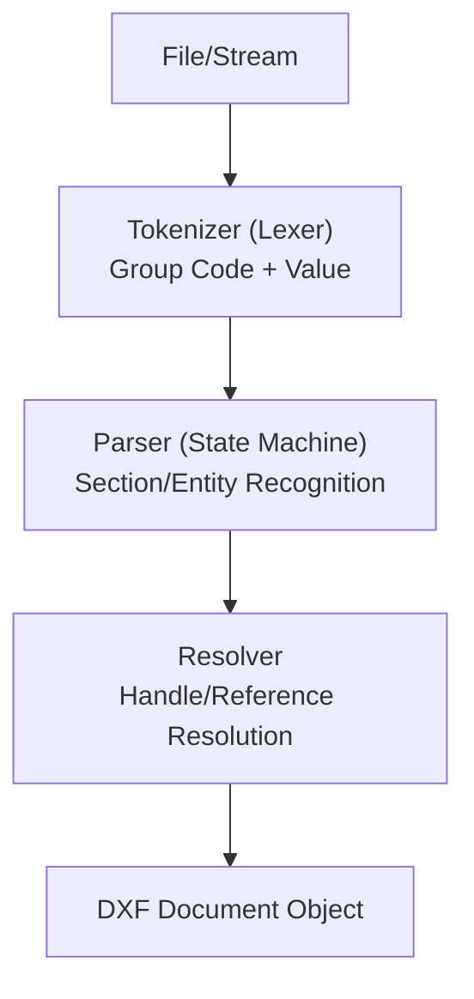

# パーサーの設計

DXFファイルを効率的かつ堅牢に読み込むための、アーキテクチャ設計と実装戦略を解説します。

## 1. パイプライン構造

DXFパーサーは、以下の3つの主要なフェーズで構成されるパイプラインとして設計するのが最適です。

## 2. 状態遷移表 (Parser States)

DXFは階層構造を持つため、ステートマシンによる制御が推奨されます。以下は、主要な状態遷移の定義です。

| 現在の状態 | 入力 (Code=0, Value) | 次の状態 | 処理内容 |
| :--- | :--- | :--- | :--- |
| `ROOT` | `SECTION` | `SECTION_START` | セクション開始の準備 |
| `SECTION_START` | `(Code 2: NAME)` | `IN_SECTION` | セクション名の識別（HEADER等） |
| `IN_SECTION` | `ENDSEC` | `ROOT` | セクション終了、データの確定 |
| `IN_SECTION (ENTITIES)` | `(Any Entity Type)` | `IN_ENTITY` | エンティティオブジェクトの生成 |
| `IN_ENTITY` | `(Any Entity Type)` | `IN_ENTITY` | 直前のエンティティを保存し次を生成 |
| `IN_ENTITY` | `ENDSEC` | `ROOT` | セクション終了、最後のエンティティ保存 |
| `ANY` | `EOF` | `FINISHED` | 読み込み完了 |

## 3. テスト戦略

DXFパーサーの品質を担保するために、以下のテスト手法を推奨します。

### 1. ラウンドトリップ・テスト (Round-trip Test)
「読み込み → そのまま書き出し」を行い、元ファイルと出力ファイルが論理的に同一（座標やハンドルが不変）であることを確認します。
※ テキストの空白などは変わる可能性があるため、バイナリ比較ではなく、再度読み込んでデータ構造で比較します。

### 2. 視覚的バリデーション
パースしたデータを SVG や Canvas に描画し、オリジナルの図面（AutoCAD等で出力したPDF）と目視で比較します。特に **OCS（座標系）** のバグを発見するのに有効です。

### 3. 不完全データの耐性テスト
- `EOF` がないファイル
- `HEADER` セクションがないファイル
- グループコードの順序がバラバラなエンティティ
これらのケースでもクラッシュせず、可能な限りデータを救い出せるかを確認します。

## 4. 堅牢なパースの指針

1. **型安全な値の変換**: グループコードごとに期待される型（float, int, string）が厳密に決まっています。不正な型が来た場合にデフォルト値を返すか、エラーとしてスキップする機構を持たせましょう。
2. **未知のコードの無視**: DXFの仕様は常に拡張されています。自分が知らないグループコードが出てきても、それを無視して次のペアに進む柔軟性が必要です。
3. **文字コードのフォールバック**: UTF-8でパースに失敗した場合、CP932(Shift-JIS)やWindows-1252で再試行する機構があると、古い日本の図面データにも対応できます。

## 5. パフォーマンス最適化

- **巨大ファイルのストリーミング**: `ENTITIES` セクションが数百万行に及ぶ場合、ファイル全体をメモリに載せず、1エンティティ読み込むごとにコールバック（ジェネレータ）を呼ぶ方式が有効です。
- **ハンドルの事前インデックス化**: 参照解決フェーズを高速化するため、パース中に「ハンドル → オブジェクト」のハッシュマップを構築しておくことが必須です。

---
関連：[よくある罠](./common-pitfalls.md) | [主要ライブラリ](./libraries.md)
