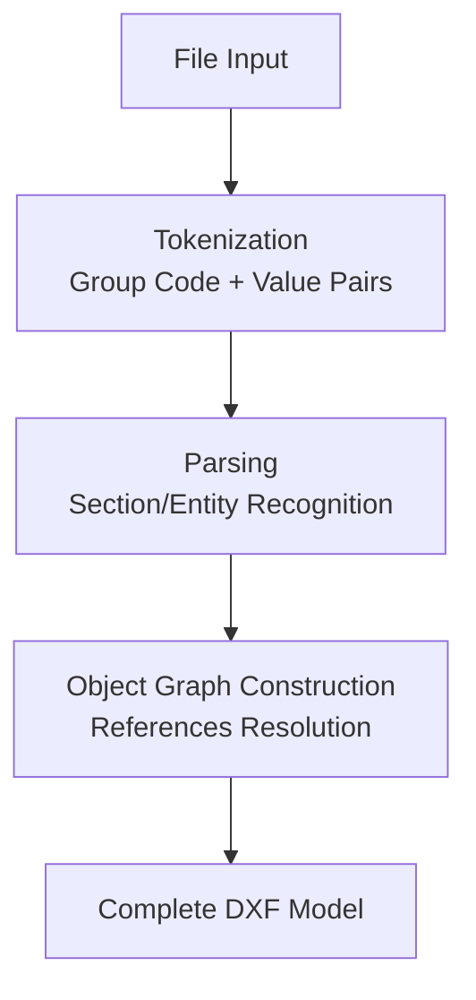
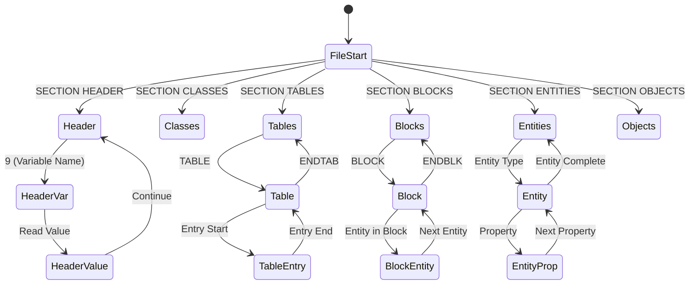

# パーサーの設計

DXFファイルを効率的に読み込むためのパーサー設計について、ステートマシン、メモリ管理、オブジェクトグラフ構築の観点から解説します。

## 基本的なパーサー構造

DXFパーサーは、以下の3つの主要なフェーズで構成されます：



## フェーズ1: トークン化（Tokenization）

DXFファイルは、2行1セットの「グループコード + 値」のペアで構成されています。

### 基本的なトークン化アルゴリズム

```python
def tokenize_dxf(file):
    tokens = []
    while True:
        line1 = file.readline().strip()
        if not line1:
            break
        line2 = file.readline().strip()
        
        try:
            group_code = int(line1)
            tokens.append((group_code, line2))
        except ValueError:
            # エラーハンドリング
            continue
    
    return tokens
```

**実装上の注意**:
- グループコードの前後にある空白は無視するか、`trim()` で処理します。
- 空行や不正な形式の行に対しては、エラーを報告するか、スキップする戦略を決めます。

## フェーズ2: パーシング（ステートマシン）

DXFファイルは階層構造（セクション → エンティティ → プロパティ）を持っているため、**ステートマシン**を使ったパーシングが効果的です。

### ステートマシンの状態



### 実装例（Python風の疑似コード）

```python
class DxfParser:
    def __init__(self):
        self.state = 'FILE_START'
        self.current_section = None
        self.current_entity = None
        self.header_vars = {}
        self.tables = {}
        self.blocks = {}
        self.entities = []
    
    def parse(self, tokens):
        i = 0
        while i < len(tokens):
            code, value = tokens[i]
            
            if code == 0:  # エンティティ/セクション開始
                if value == 'SECTION':
                    self.state = 'SECTION_START'
                elif value == 'ENDSEC':
                    self.state = 'FILE_START'
                    self.current_section = None
                elif value == 'EOF':
                    break
                elif self.state == 'IN_SECTION':
                    self._start_entity(value)
                else:
                    self._handle_entity_start(value)
            
            elif code == 2:  # 名前/識別子
                if self.state == 'SECTION_START':
                    self.current_section = value
                    self.state = 'IN_SECTION'
                elif self.current_section == 'HEADER':
                    self._current_var_name = value
                # ... 他の処理
            
            elif code == 9:  # ヘッダー変数名
                self._current_var_name = value
            
            else:
                self._process_property(code, value)
            
            i += 1
```

## フェーズ3: オブジェクトグラフの構築

パーシング後、参照関係を解決して完全なオブジェクトグラフを構築します。

### 参照解決の順序

1. **テーブルエントリの辞書化**: LAYER, LTYPE, STYLEなどのテーブルを名前で検索できるようにします。
2. **ブロック定義の辞書化**: BLOCKSセクションのブロックを名前で検索できるようにします。
3. **エンティティの参照解決**: エンティティが参照する画層、線種、ブロックを解決します。

```python
def resolve_references(self):
    # 1. テーブルエントリの辞書化
    self.layer_dict = {layer.name: layer for layer in self.tables['LAYER']}
    self.ltype_dict = {ltype.name: ltype for ltype in self.tables['LTYPE']}
    
    # 2. ブロック定義の辞書化
    self.block_dict = {block.name: block for block in self.blocks.values()}
    
    # 3. エンティティの参照解決
    for entity in self.entities:
        if hasattr(entity, 'layer_name'):
            entity.layer = self.layer_dict.get(entity.layer_name, self.default_layer)
        if hasattr(entity, 'ltype_name'):
            entity.ltype = self.ltype_dict.get(entity.ltype_name, self.default_ltype)
        if isinstance(entity, Insert):
            entity.block_def = self.block_dict.get(entity.block_name)
```

## メモリ効率の最適化

大きなDXFファイル（数万エンティティ）を扱う場合、メモリ使用量を最適化する必要があります。

### ストリーミングパーサー

すべてのエンティティをメモリに保持せず、1つずつ処理する方式：

```python
def parse_streaming(file, callback):
    """エンティティを1つずつ処理するコールバック方式"""
    parser = DxfParser()
    current_entity = None
    
    for code, value in tokenize_dxf(file):
        if code == 0:
            if current_entity:
                callback(current_entity)  # エンティティを処理
            current_entity = create_entity(value)
        else:
            current_entity.set_property(code, value)
    
    if current_entity:
        callback(current_entity)
```

### 遅延読み込み

ブロック定義やテーブルエントリを、実際に参照されるまで読み込まない方式：

```python
class LazyBlockLoader:
    def __init__(self, block_definitions):
        self.definitions = block_definitions
        self.cache = {}
    
    def get_block(self, name):
        if name not in self.cache:
            self.cache[name] = self._load_block(name)
        return self.cache[name]
```

## エラーハンドリング

### 一般的なエラーケース

1. **不完全なDXF**: セクションが閉じられていない、EOFがない
2. **不正なグループコード**: 期待される型と異なる値
3. **参照エラー**: 存在しない画層やブロックを参照
4. **文字エンコーディング**: 古いバージョンでの文字化け

### エラー回復戦略

```python
class ErrorRecovery:
    def handle_missing_section_end(self):
        # セクションが閉じられていない場合、警告を出して続行
        logger.warning("Section not properly closed, attempting recovery")
        self.state = 'FILE_START'
    
    def handle_missing_reference(self, ref_type, ref_name):
        # 参照が見つからない場合、デフォルト値を使用
        logger.warning(f"Missing {ref_type}: {ref_name}, using default")
        return self.get_default(ref_type)
```

## パフォーマンスのベンチマーク

一般的なDXFファイルサイズでの目安：

| エンティティ数 | ファイルサイズ | パース時間（目安） |
| :--- | :--- | :--- |
| 1,000 | ~100 KB | < 100 ms |
| 10,000 | ~1 MB | < 500 ms |
| 100,000 | ~10 MB | < 5 s |
| 1,000,000 | ~100 MB | < 60 s |

**最適化のヒント**:
- トークン化とパーシングを統合して、メモリアクセスを減らす
- 頻繁に参照されるテーブルエントリ（LAYER "0"など）をキャッシュ
- 並列処理が可能な部分（エンティティの変換など）は並列化を検討

## 実装のベストプラクティス

1. **段階的な実装**: まず最小限の機能（ENTITIESセクションのみ）で動作させ、段階的に機能を追加
2. **テストデータの準備**: 様々なバージョン、サイズ、複雑さのDXFファイルでテスト
3. **ログ機能**: デバッグ時にパースの進行状況を追跡できるようにする
4. **バリデーション**: パース後に、データの整合性をチェックする機能を追加
