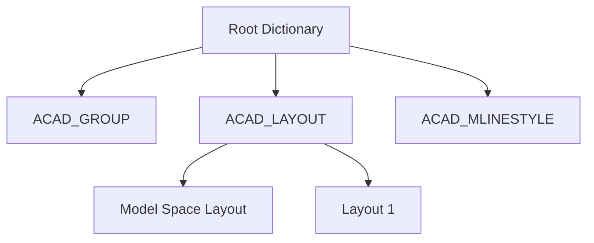

# OBJECTS Section

The **OBJECTS section**, introduced in AutoCAD 2000 (AC1015) and later, is an important place for managing non-graphic data (logical structures and settings other than shapes) within drawings.

In parser implementation, understanding this section becomes essential when going beyond simple "extraction of lines and circles" to "understanding layout structure" or "obtaining custom properties."

## 1. Role: The "Brain" of the Drawing

While the `ENTITIES` section governs the "appearance" of the drawing, the `OBJECTS` section manages the "logic" of the drawing.

Main roles:
- **DICTIONARY**: Management of parent-child relationships between objects and named data.
- **LAYOUT**: Settings for spaces (model space/paper space).
- **DIMSTYLE**: Detailed setting information for dimension lines.
- **GROUP**: Logical grouping of entities.

## 2. DICTIONARY Structure

The foundation of the `OBJECTS` section is the **DICTIONARY** object. This is a container that holds pairs of keys (names) and values (pointers/handles to objects).

### Root Dictionary (Named Object Dictionary)
All DXF files implicitly have a "root dictionary." From here, you can traverse to all logical data such as layout dictionaries and group dictionaries.

## 3. Major Object Types

| Object Name | Description |
| :--- | :--- |
| **DICTIONARY** | Container for named data. |
| **LAYOUT** | Layout for print settings and viewport management. |
| **ACAD_PROXY_OBJECT** | Placeholder for unknown objects created by other applications. |
| **XRECORD** | Generic container for storing arbitrary data (often used by application developers). |
| **IDBUFFER** | Buffer that holds multiple object references. |

## 4. Importance in Parser Implementation

### Layout Identification
To determine whether shapes in the `ENTITIES` section are in "model space" or a specific "layout (paper space)," you need to match `LAYOUT` objects in the `OBJECTS` section with entities' `owner` handles.

### Reference Resolution by Handles
In DXF 2000 and later, almost all elements have unique IDs via code `5` (handle). Objects in the `OBJECTS` section are complexly linked with `TABLES` and `ENTITIES` using these handles.

## 5. Minimal Parsing Strategy

If your goal is only simple shape extraction, you can ignore (skip) the `OBJECTS` section. However, parsing is needed in the following cases:
1. When you want to correctly exclude or separate **paper space shapes**.
2. When you want to reproduce detailed formatting of **dimensions (DIMENSION)**.
3. When you want to use **group information**.

---
Related: [Section Overview](./sections-overview.md) | [Common Pitfalls](../implementation/common-pitfalls.md)

