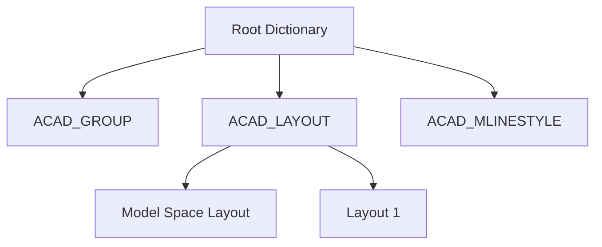

# OBJECTS セクション

AutoCAD 2000 (AC1015) 以降で導入された **OBJECTS セクション** は、図面内の非図形データ（図形以外の論理構造や設定）を管理するための重要な場所です。

パーサーの実装において、単純な「線や円の抽出」を超えて、「レイアウト構成の理解」や「カスタムプロパティの取得」を行う場合に、このセクションの理解が不可欠になります。

## 1. 役割：図面の「頭脳」

`ENTITIES` セクションが図面の「見た目」を司るのに対し、`OBJECTS` セクションは図面の「論理」を管理します。

主な役割：
- **DICTIONARY（辞書）**: オブジェクト間の親子関係や名前付きデータの管理。
- **LAYOUT（レイアウト）**: 空間（モデル空間・ペーパー空間）の設定。
- **DIMSTYLE（寸法スタイル）**: 寸法線の詳細な設定情報。
- **GROUP（グループ）**: エンティティの論理的なグループ化。

## 2. DICTIONARY（辞書）構造

`OBJECTS` セクションの根幹は **DICTIONARY** オブジェクトです。これは、キー（名前）と値（オブジェクトへのポインタ/ハンドル）のペアを保持するコンテナです。

### ルート辞書 (Named Object Dictionary)
すべてのDXFファイルには、暗黙的に「ルート辞書」が存在します。ここから、レイアウト辞書やグループ辞書など、すべての論理データへ辿ることができます。

## 3. 主要なオブジェクトタイプ

| オブジェクト名 | 説明 |
| :--- | :--- |
| **DICTIONARY** | 名前付きデータのコンテナ。 |
| **LAYOUT** | 印刷設定やビューポート管理を行うレイアウト。 |
| **ACAD_PROXY_OBJECT** | 他のアプリケーションで作成された不明なオブジェクトのプレースホルダ。 |
| **XRECORD** | 任意のデータを保存するための汎用的なコンテナ（アプリケーション開発者が多用）。 |
| **IDBUFFER** | 複数のオブジェクト参照を保持するバッファ。 |

## 4. パーサー実装における重要性

### レイアウトの識別
`ENTITIES` セクションにある図形が「モデル空間」にあるのか、それとも特定の「レイアウト（ペーパー空間）」にあるのかを判別するには、`OBJECTS` セクション内の `LAYOUT` オブジェクトと、エンティティの `owner` ハンドルを照合する必要があります。

### ハンドルによる参照解決
2000以降のDXFでは、ほぼすべての要素が `5` 番のコード（ハンドル）による一意なIDを持っています。`OBJECTS` セクション内のオブジェクトは、このハンドルを使って `TABLES` や `ENTITIES` と複雑にリンクしています。

## 5. 最小限のパース戦略

もし、単純な図形抽出だけが目的であれば、`OBJECTS` セクションを無視（スキップ）しても問題ありません。しかし、以下の場合はパースが必要です：
1. **ペーパー空間の図形**を正しく除外、または分離したい場合。
2. **寸法(DIMENSION)** の詳細な書式を再現したい場合。
3. **グループ情報**を利用したい場合。

---
関連：[セクション概要](./sections-overview.md) | [よくある罠](../implementation/common-pitfalls.md)

