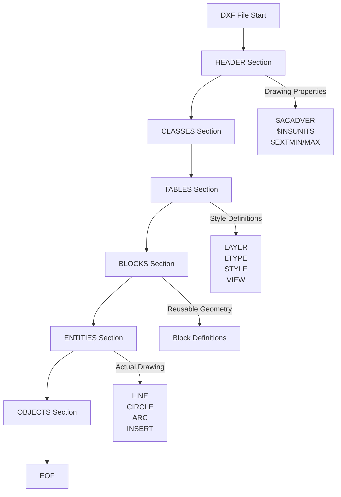

# セクション概要

DXFファイルは、複数の **セクション（SECTION）** で構成されています。各セクションは特定の種類のデータを格納し、ファイル全体の構造を定義します。

## セクションの全体構造



## HEADER セクション

**役割**: 図面全体の設定やプロパティを格納します。

すべてのヘッダー変数は `$` で始まる名前を持ち、グループコード `9` で指定されます。

```text
  0
SECTION
  2
HEADER
  9
$ACADVER
  1
AC1015
  9
$INSUNITS
 70
1
  0
ENDSEC
```

**主要な変数**:
- `$ACADVER`: AutoCADのバージョン（例: `AC1015` = AutoCAD 2000）
- `$INSUNITS`: 単位系（0=単位なし、1=インチ、2=フィート、...、6=メートル）
- `$EXTMIN`, `$EXTMAX`: 図面の範囲（最小/最大座標）
- `$HANDSEED`: 次に割り当てるハンドル（オブジェクトID）のシード値

## CLASSES セクション

**役割**: アプリケーション定義のクラス情報を格納します。通常、カスタムオブジェクトや拡張機能で使用されます。

多くのDXFファイルでは空か、最小限の情報しか含まれません。

## TABLES セクション

**役割**: 再利用可能なスタイル定義（レイヤー、線種、文字スタイルなど）を格納します。

```text
  0
SECTION
  2
TABLES
  0
TABLE
  2
LAYER
  5
2
 70
1
  0
LAYER
  5
10
  2
MyLayer
 70
0
 62
7
  6
CONTINUOUS
  0
ENDTAB
  0
ENDSEC
```

**主要なテーブル**:
- **LAYER**: 画層（レイヤー）の定義。各エンティティは画層に属します。
- **LTYPE**: 線種（実線、破線、一点鎖線など）の定義。
- **STYLE**: 文字スタイル（フォント、高さなど）の定義。
- **VIEW**: 名前付きビューの定義。
- **UCS**: ユーザー座標系の定義。
- **VPORT**: ビューポートの定義。

## BLOCKS セクション

**役割**: 再利用可能な図形の定義（ブロック定義）を格納します。

ブロックは、複数のエンティティを1つの単位としてグループ化したものです。定義自体はここに格納され、実際の配置は ENTITIES セクションの `INSERT` エンティティで参照されます。

```text
  0
SECTION
  2
BLOCKS
  0
BLOCK
  5
20
  2
MyBlock
 70
0
 10
0.0
 20
0.0
 30
0.0
  0
LINE
  8
0
 10
0.0
 20
0.0
 11
10.0
 21
10.0
  0
ENDBLK
  5
21
  0
ENDSEC
```

## ENTITIES セクション

**役割**: 実際に描画される図形要素（エンティティ）を格納します。

これがDXFファイルの「本体」です。LINE, CIRCLE, ARC, LWPOLYLINE, TEXT, INSERT など、すべての描画要素がここに記述されます。

```text
  0
SECTION
  2
ENTITIES
  0
LINE
  8
0
 10
0.0
 20
0.0
 11
10.0
 21
10.0
  0
CIRCLE
  8
0
 10
5.0
 20
5.0
 30
0.0
 40
2.5
  0
ENDSEC
```

## OBJECTS セクション

**役割**: 非図形データ（辞書、レイアウト、寸法スタイルなど）を格納します。

AutoCAD 2000以降で導入されました。図面の論理構造やメタデータを格納するために使用されます。

```text
  0
SECTION
  2
OBJECTS
  0
DICTIONARY
  5
C
  3
ACAD_GROUP
  0
ENDSEC
```

## セクションの読み込み順序

パーサーを実装する際は、以下の順序でセクションを処理するのが一般的です：

1. **HEADER**: 図面の基本情報を取得（バージョン、単位など）
2. **TABLES**: スタイル定義を読み込み、後続のエンティティで参照できるようにする
3. **BLOCKS**: ブロック定義を読み込み、INSERTエンティティで参照できるようにする
4. **ENTITIES**: 実際の図形を読み込み、画層やブロックの参照を解決する
5. **OBJECTS**: 必要に応じて非図形データを処理

## 最小構成のDXF

技術的には、`ENTITIES` セクションだけでも動作するDXFファイルを作成できます（多くのCADソフトがデフォルト値を補完します）。しかし、正式なDXFファイルには、少なくとも `HEADER` と `ENTITIES` セクションが必要です。
