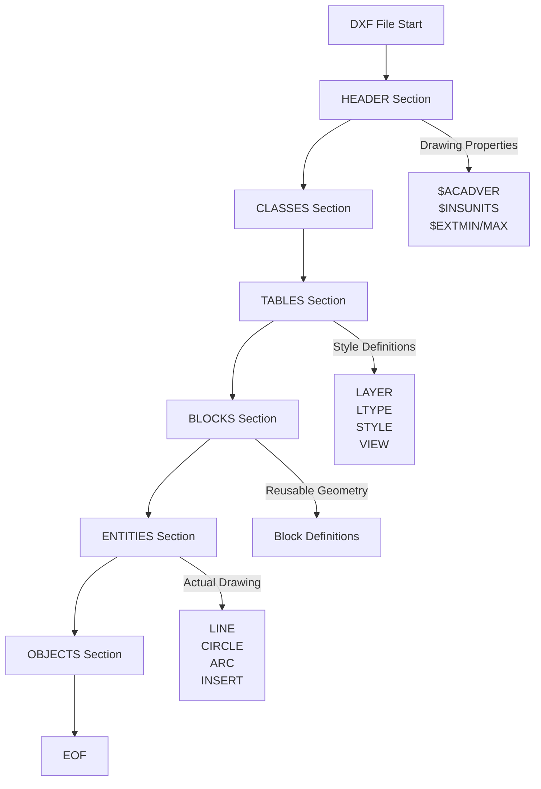

# Section Overview

DXF files consist of multiple **sections (SECTION)**. Each section stores specific types of data and defines the overall file structure.

## Overall Section Structure



## HEADER Section

**Role**: Stores settings and properties for the entire drawing.

All header variables have names starting with `$` and are specified with group code `9`.

```text
  0        <-- Section start
SECTION
  2        <-- Section name
HEADER
  9        <-- Variable name
$ACADVER
  1        <-- Value
AC1015
  9
$INSUNITS
 70
1
  0        <-- Section end
ENDSEC
```

**Major Variables**:
- `$ACADVER`: AutoCAD version (e.g., `AC1015` = AutoCAD 2000)
- `$INSUNITS`: Unit system (0=unitless, 1=inch, 2=feet, ..., 6=meter)
- `$EXTMIN`, `$EXTMAX`: Drawing extents (minimum/maximum coordinates)
- `$HANDSEED`: Seed value for the next handle (object ID) to be assigned

## CLASSES Section

**Role**: Stores application-defined class information. Typically used for custom objects or extensions.

Many DXF files contain minimal or no information here.

## TABLES Section

**Role**: Stores reusable style definitions (layers, linetypes, text styles, etc.).

```text
  0        <-- Section start
SECTION
  2
TABLES
  0        <-- Table start
TABLE
  2        <-- Table type
LAYER
  5        <-- Handle ID
2
 70
1
  0        <-- Individual entry (layer) start
LAYER
  5
10
  2        <-- Layer name
MyLayer
 70
0
 62        <-- Color number
7
  6        <-- Linetype name
CONTINUOUS
  0        <-- Table end
ENDTAB
  0
ENDSEC
```

**Major Tables**:
- **LAYER**: Definition of layers. Each entity belongs to a layer.
- **LTYPE**: Definition of linetypes (solid, dashed, center line, etc.).
- **STYLE**: Definition of text styles (font, height, etc.).
- **VIEW**: Definition of named views.
- **UCS**: Definition of user coordinate systems.
- **VPORT**: Definition of viewports.

## BLOCKS Section

**Role**: Stores definitions of reusable shapes (block definitions).

Blocks are groups of multiple entities as a single unit. The definitions themselves are stored here, and actual placements are referenced by `INSERT` entities in the ENTITIES section.

```text
  0        <-- Section start
SECTION
  2
BLOCKS
  0        <-- Block definition start
BLOCK
  5
20
  2        <-- Block name
MyBlock
 70
0
 10        <-- Base point X
0.0
 20        <-- Base point Y
0.0
 30        <-- Base point Z
0.0
  0        <-- Shape (LINE) in block start
LINE
  8
0
 10
0.0
 20
0.0
 11
10.0
 21
10.0
  0        <-- Block definition end
ENDBLK
  5
21
  0
ENDSEC
```

## ENTITIES Section

**Role**: Stores graphic elements (entities) that are actually drawn.

This is the "main body" of a DXF file. LINE, CIRCLE, ARC, LWPOLYLINE, TEXT, INSERT, and all other drawing elements are described here.

```text
  0        <-- Section start
SECTION
  2
ENTITIES
  0        <-- Line (LINE) start
LINE
  8
0
 10        <-- Start point X
0.0
 20        <-- Start point Y
0.0
 11        <-- End point X
10.0
 21        <-- End point Y
10.0
  0        <-- Circle (CIRCLE) start
CIRCLE
  8
0
 10        <-- Center X
5.0
 20        <-- Center Y
5.0
 30
0.0
 40        <-- Radius
2.5
  0
ENDSEC
```

## OBJECTS Section

**Role**: Stores non-graphic data (dictionaries, layouts, dimension styles, etc.).

Introduced in AutoCAD 2000 and later. Used to store the logical structure and metadata of drawings.

```text
  0        <-- Section start
SECTION
  2
OBJECTS
  0        <-- Non-graphic object (DICTIONARY)
DICTIONARY
  5
C
  3
ACAD_GROUP
  0
ENDSEC
```

## Section Reading Order

When implementing a parser, it's common to process sections in the following order:

1. **HEADER**: Get basic drawing information (version, units, etc.)
2. **TABLES**: Read style definitions so they can be referenced by subsequent entities
3. **BLOCKS**: Read block definitions so they can be referenced by INSERT entities
4. **ENTITIES**: Read actual shapes and resolve layer and block references
5. **OBJECTS**: Process non-graphic data as needed

## Minimal DXF Structure

Technically, you can create a DXF file that works with just the `ENTITIES` section (many CAD software supplement default values). However, a formal DXF file requires at least `HEADER` and `ENTITIES` sections.
