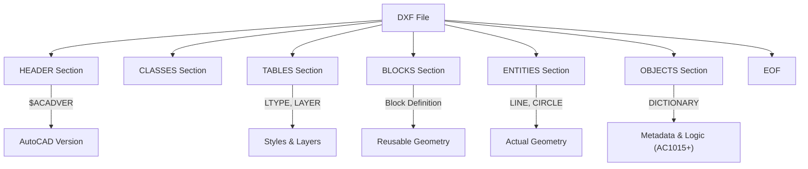

# タグ構造とグループコードの基本

DXFは、すべてのデータを **「グループコード」** と呼ばれる数値タグで管理する、タグベースのテキスト形式です。

## 1. グループコードの仕組み

DXFファイル内のすべてのデータは、**「2行で1つの意味を持つ」**ペアで構成されます。

- **1行目**: グループコード（整数）。「次の行が何を表すか」という役割を示します。
- **2行目**: 値（文字列、数値など）。そのグループコードに対応する具体的な中身です。

### 例：画層名（レイヤー）の指定
```text
  8        <-- 「これは画層名ですよ」という合図
Layer1     <-- 具体的な名前
```

### なぜ文字列ではなく「数字」なのか？
現代のフォーマット（JSONやXML）なら `"layer": "Layer1"` と書くところですが、DXFが誕生した1980年代初頭のコンピュータは非常に非力でした。
パーサー（解析プログラム）にとって、長い英単語を比較するよりも、**「1つの整数を読み取って判断する」**方が遥かに処理が速く、メモリも節約できたため、このような数字ベースの設計になりました。

## 2. 主要なグループコードとデータ型

グループコードの「数字の範囲」によって、その後に続くデータの型（文字列なのか、小数なのか、整数なのか）が厳密に決まっています。

| コード範囲 | データ型 | 主な意味 | 覚え方のヒント |
| :--- | :--- | :--- | :--- |
| **0** | 文字列 | エンティティの開始宣言 | `LINE`, `CIRCLE`, `SECTION` など |
| **2** | 文字列 | 名前 | セクション名、ブロック名など |
| **5** | 文字列 | **ハンドル** | 16進数のID（オブジェクト固有の背番号） |
| **8** | 文字列 | **画層名（レイヤー）** | 必須の属性 |
| **10, 20, 30** | 浮動小数点 | **基準点 (X, Y, Z)** | 10=X, 20=Y, 30=Z と対応 |
| **40 - 48** | 浮動小数点 | 数値 | 半径、高さ、倍率など |
| **62** | 整数 | **色番号** | 1-255 のインデックスカラー |
| **100** | 文字列 | サブクラスマーカー | 内部的な型定義（R13以降） |
| **999** | 文字列 | **コメント** | CADに無視される自由なメモ |

## 3. コメントの書き方 (999番)

DXFには人間が読むためのコメントを残すことができます。

```text
999
この部分は自動生成スクリプトで作成されました
```
このコード `999` の次の行は、多くのCADソフトで読み飛ばされます。デバッグや独自のメタデータを埋め込むのに便利です。

## 3. Binary DXF (バイナリ形式)

DXFには通常のテキスト形式（ASCII）の他に、ファイルサイズを抑えるための **Binary形式** が存在します。

### ASCII と Binary の見分け方
ファイルの先頭数バイトを確認します。
- **ASCII**: `  0\nSECTION`（またはBOM `\xEF\xBB\xBF` で始まる）
- **Binary**: `AutoCAD Binary DXF\r\n\x1a\x00` というシグネチャで始まります。

### Binary 形式の構造
Binary DXFでは、グループコードと値がテキストではなく、バイナリデータとしてパックされています。
- **グループコード**: 通常 1バイト、または 2バイト（R13以降）の整数。
- **値**: コードの型に応じて、ヌル終端文字列、8バイト浮動小数点、整数などがそのまま格納されます。

パーサーを実装する場合、まずこのシグネチャを確認して「ASCIIパーサー」か「バイナリパーサー」かを切り替える必要があります。

## 4. ファイルの全体構造

DXFファイルは、複数の `SECTION` で構成されています。セクションの順序は厳密ではありませんが、AutoCADとの互換性のために以下の順序が推奨されます。



## 5. 実装上の注意点

1. **固定精度のテキスト**: ASCII形式では数値がテキストとして保存されます。`1.23456789012345` のように非常に長い浮動小数点が来る可能性があるため、パース時には精度を失わないように注意してください。
2. **空白の扱い**: 古いR12形式などでは、グループコードの前に 2つ（または 3つ）の空白が含まれるのが標準でした。現代のパーサーは `strip()` または `trim()` を行うのが一般的ですが、自作する場合はこの「緩さ」を受け入れる必要があります。
3. **セクションの省略**: 多くのビューワーは `ENTITIES` 以外のセクションがなくても読み込みますが、`EOF`（End Of File）マーカーがないファイルは「壊れている」とみなされることが多いです。

---
関連：[セクション概要](./sections-overview.md) | [用語集](../docs/glossary.md)
