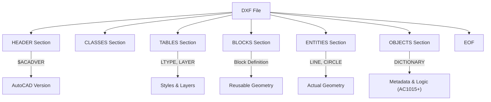

# タグ構造とグループコードの基本

DXFは、すべてのデータを **「グループコード」** と呼ばれる数値タグで管理する、タグベースのテキスト形式です。

## 1. グループコードの仕組み

DXFファイル内のすべてのデータは、2行1セットのペアで構成されます。

- **1行目**: グループコード（整数）
- **2行目**: そのグループコードに対応する値（文字列、数値、真偽値など）

### 例：画層名の指定
```text
  8
Layer1
```
ここでは `8` が「画層名」を意味するグループコードで、`Layer1` がその値です。

## 2. 主要なグループコードとデータ型

グループコードの値によって、その後に続くデータの型が決まっています。これはパーサーを実装する際の「読み込み戦略」に直結します。

### データ型と範囲

| コード範囲 | データ型 | 主な意味 |
| :--- | :--- | :--- |
| **0** | 文字列 | エンティティ、セクション、テーブル等の開始宣言（例: `LINE`, `SECTION`） |
| **1** | 文字列 | エンティティの主要なテキスト値（`TEXT` の内容など） |
| **2** | 文字列 | 名前（セクション名、テーブル名、ブロック名など） |
| **3 - 4** | 文字列 | その他のテキスト、または長い文字列の分割分 |
| **5** | 文字列 | **ハンドル**（16進数のオブジェクトID。2000以降で必須） |
| **6** | 文字列 | 線種名 |
| **7** | 文字列 | 文字スタイル名 |
| **8** | 文字列 | **画層名（レイヤー）** |
| **10, 20, 30** | 浮動小数点 | **基準点 (X, Y, Z)**。始点、中心点など |
| **11 - 18, ...** | 浮動小数点 | その他の座標点 (X, Y, Z) |
| **40 - 48** | 浮動小数点 | 数値（半径、高さ、線種スケールなど） |
| **50 - 58** | 浮動小数点 | 角度（度単位、反時計回り） |
| **62** | 整数 | **色番号** (1-255, 0=ByBlock, 256=ByLayer) |
| **70 - 78** | 整数 | フラグ、計数値、モード設定（16bit） |
| **90 - 99** | 整数 | 32bit 整数 |
| **100** | 文字列 | **サブクラスマーカー**（オブジェクトの型階層を定義） |
| **102** | 文字列 | 拡張データグループの開始/終了（例: `{ACAD_REACTORS`） |
| **210, 220, 230** | 浮動小数点 | **法線ベクトル（押し出し方向）**。OCSの算出に必須 |
| **330 - 369** | 文字列 | 他のオブジェクトへのポインタ（ID参照） |
| **1000 - 1071** | 混合 | 拡張データ (XDATA)。アプリケーション独自の保存領域 |

## 3. Binary DXF (バイナリ形式)

DXFには通常のテキスト形式（ASCII）の他に、ファイルサイズを抑えるための **Binary形式** が存在します。

### ASCII と Binary の見分け方
ファイルの先頭数バイトを確認します。
- **ASCII**: `  0\nSECTION`（またはBOM `\xEF\xBB\xBF` で始まる）
- **Binary**: `AutoCAD Binary DXF\r\n\x1a\x00` というシグネチャで始まります。

### Binary 形式の構造
Binary DXFでは、グループコードと値がテキストではなく、バイナリデータとしてパックされています。
- **グループコード**: 通常 1バイト、または 2バイト（R13以降）の整数。
- **値**: コードの型に応じて、ヌル終端文字列、8バイト浮動小数点、整数などがそのまま格納されます。

パーサーを実装する場合、まずこのシグネチャを確認して「ASCIIパーサー」か「バイナリパーサー」かを切り替える必要があります。

## 4. ファイルの全体構造

DXFファイルは、複数の `SECTION` で構成されています。セクションの順序は厳密ではありませんが、AutoCADとの互換性のために以下の順序が推奨されます。



## 5. 実装上の注意点

1. **固定精度のテキスト**: ASCII形式では数値がテキストとして保存されます。`1.23456789012345` のように非常に長い浮動小数点が来る可能性があるため、パース時には精度を失わないように注意してください。
2. **空白の扱い**: 古いR12形式などでは、グループコードの前に 2つ（または 3つ）の空白が含まれるのが標準でした。現代のパーサーは `strip()` または `trim()` を行うのが一般的ですが、自作する場合はこの「緩さ」を受け入れる必要があります。
3. **セクションの省略**: 多くのビューワーは `ENTITIES` 以外のセクションがなくても読み込みますが、`EOF`（End Of File）マーカーがないファイルは「壊れている」とみなされることが多いです。

---
関連：[セクション概要](./sections-overview.md) | [用語集](../docs/glossary.md)
