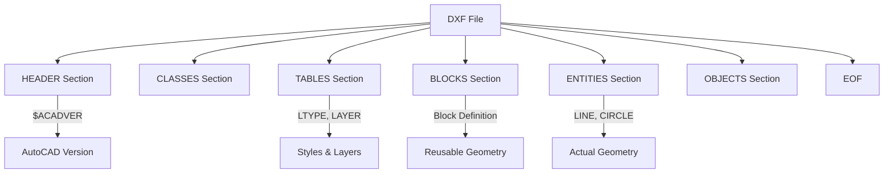

# タグ構造とグループコードの基本

DXFは、すべてのデータを **「グループコード」** と呼ばれる数値タグで管理する、タグベースのテキスト形式です。

## グループコードの仕組み

DXFファイル内のすべてのデータは、2行1セットのペアで構成されます。

- **1行目**: グループコード（整数）
- **2行目**: そのグループコードに対応する値（文字列、数値、真偽値など）

### 例：画層名の指定
```text
  8
Layer1
```
ここでは `8` が「画層名」を意味するグループコードで、`Layer1` がその値です。

## 主要なグループコードの範囲

グループコードの値によって、その後に続くデータの型（データ型）が決まっています。

| コード範囲 | データ型 | 説明 |
| :--- | :--- | :--- |
| 0 - 9 | 文字列 | エンティティ名、変数名、テキストなど |
| 10 - 39 | 浮動小数点 | 座標値 (X, Y, Z) の基準点 |
| 40 - 59 | 浮動小数点 | 半径、倍率、角度など |
| 60 - 79 | 整数 | 16ビット整数（色番号、フラグなど） |
| 90 - 99 | 整数 | 32ビット整数 |
| 100 | 文字列 | サブクラスマーカー（特定のオブジェクト定義） |
| 210 - 239 | 浮動小数点 | 押し出し方向（法線ベクトル） |

## ファイルの全体構造

DXFファイルは、複数の `SECTION` で構成されています。



## 実装上の注意点

1. **固定精度**: 歴史的な経緯から、DXFの浮動小数点はテキストとして保存されるため、パーサーでの読み込み時に精度（64bit double推奨）に気をつける必要があります。
2. **空白の扱い**: グループコードの前には通常、数文字の空白が含まれます。多くのパーサーは `trim()` 処理を行いますが、厳密な仕様では固定幅（R12等）を想定している場合もあります。
3. **文字コード**: 古いバージョン（R12など）は環境依存のコードページですが、AC1021 (AutoCAD 2007) 以降は UTF-8 が標準となっています。

