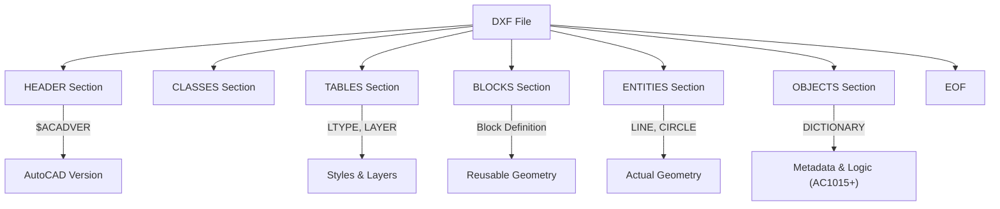

# Tag Structure and Group Code Basics

DXF is a tag-based text format that manages all data using numeric tags called **"group codes"**.

## 1. How Group Codes Work

All data in a DXF file consists of pairs that **"have one meaning in two lines"**.

- **Line 1**: Group code (integer). Indicates what the next line represents.
- **Line 2**: Value (string, number, etc.). The specific content corresponding to that group code.

### Example: Specifying Layer Name
```text
  8        <-- Signal indicating "this is a layer name"
Layer1     <-- Specific name
```

### Why Use "Numbers" Instead of Strings?
Modern formats (JSON, XML) would write `"layer": "Layer1"`, but computers in the early 1980s when DXF was born were very weak.
For parsers (parsing programs), **"reading one integer and judging"** was much faster and saved memory compared to comparing long English words, which led to this number-based design.

## 2. Major Group Codes and Data Types

The "numeric range" of group codes strictly determines the type of data that follows (whether it's a string, decimal, or integer).

| Code Range | Data Type | Main Meaning | Memory Hint |
| :--- | :--- | :--- | :--- |
| **0** | String | Entity start declaration | `LINE`, `CIRCLE`, `SECTION`, etc. |
| **2** | String | Name | Section names, block names, etc. |
| **5** | String | **Handle** | Hexadecimal ID (unique serial number for objects) |
| **8** | String | **Layer Name** | Required attribute |
| **10, 20, 30** | Floating point | **Base Point (X, Y, Z)** | 10=X, 20=Y, 30=Z correspondence |
| **40 - 48** | Floating point | Numeric value | Radius, height, scale, etc. |
| **62** | Integer | **Color Number** | Index color 1-255 |
| **100** | String | Subclass Marker | Internal type definition (R13 and later) |
| **999** | String | **Comment** | Free memo ignored by CAD |

## 3. Writing Comments (Code 999)

DXF allows comments for humans to read.

```text
999
This section was created by an auto-generation script
```
The line following code `999` is skipped by many CAD software. Useful for debugging or embedding custom metadata.

## 3. Binary DXF

In addition to the normal text format (ASCII), DXF has a **Binary format** to reduce file size.

### Distinguishing ASCII and Binary
Check the first few bytes of the file.
- **ASCII**: `  0\nSECTION` (or starts with BOM `\xEF\xBB\xBF`)
- **Binary**: Starts with signature `AutoCAD Binary DXF\r\n\x1a\x00`.

### Binary Format Structure
In Binary DXF, group codes and values are packed as binary data instead of text.
- **Group code**: Usually 1 byte, or 2 bytes (R13 and later) integer.
- **Value**: Stored directly as null-terminated strings, 8-byte floating point, integers, etc., according to the code's type.

When implementing a parser, you need to check this signature first and switch between "ASCII parser" or "binary parser."

## 4. Overall File Structure

DXF files consist of multiple `SECTION`s. The order of sections is not strict, but the following order is recommended for AutoCAD compatibility.



## 5. Implementation Notes

1. **Fixed-precision text**: In ASCII format, numbers are saved as text. Very long floating point numbers like `1.23456789012345` may appear, so be careful not to lose precision when parsing.
2. **Handling spaces**: In older R12 format, it was standard to include 2 (or 3) spaces before group codes. Modern parsers generally perform `strip()` or `trim()`, but if you're making your own, you need to accept this "looseness."
3. **Omitting sections**: Many viewers read files even without sections other than `ENTITIES`, but files without the `EOF` (End Of File) marker are often considered "broken."

---
Related: [Section Overview](./sections-overview.md) | [Glossary](../docs/glossary.md)
